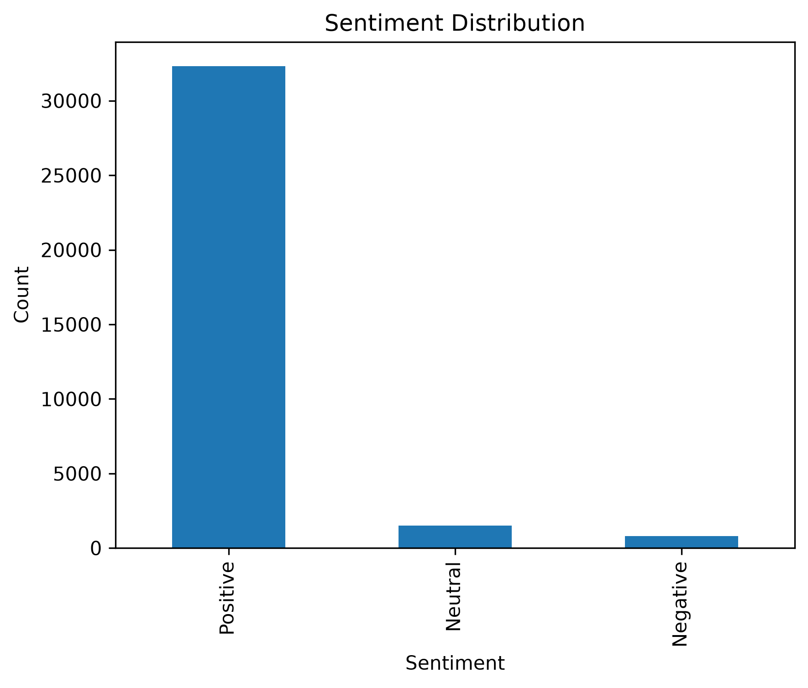
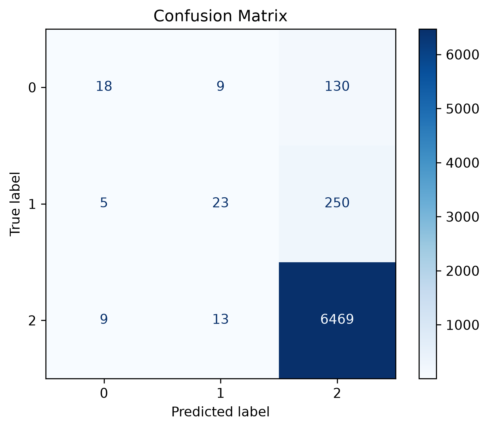
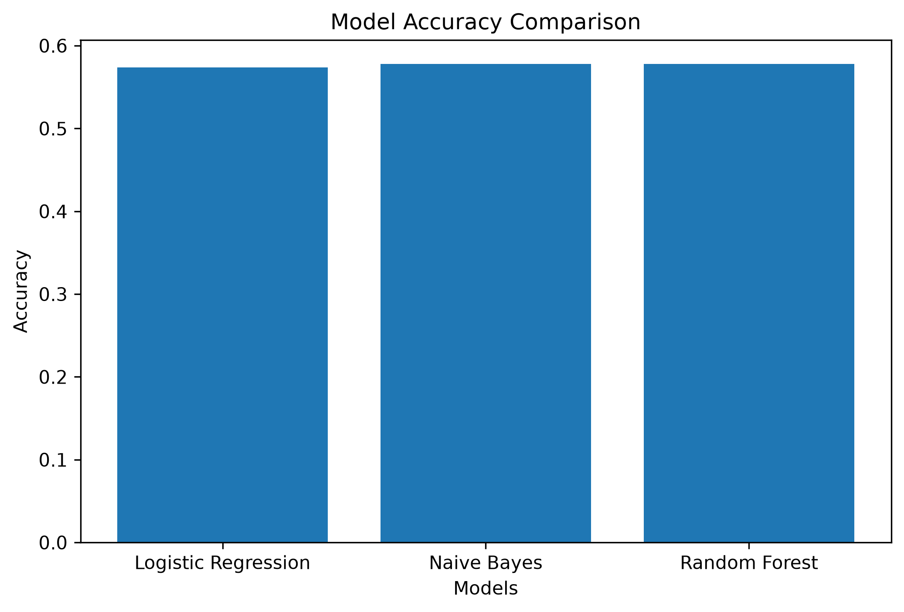

# 🤖 AI Product Review Sentiment Analyzer

An AI-powered web application that analyzes product reviews and classifies them into **Positive, Negative, or Neutral** sentiment using Machine Learning and Natural Language Processing.

The application provides sentiment prediction, confidence score, probability visualization, keyword extraction, prediction history, voice input, and downloadable PDF reports through an interactive Flask-based web interface.

---

## 🚀 Features

- 🤖 AI-based sentiment analysis
- 😊 Positive sentiment detection
- 😐 Neutral sentiment detection
- 😞 Negative sentiment detection
- 🎯 Prediction confidence score
- 📊 Sentiment probability visualization
- 📈 Sentiment distribution dashboard
- 🔑 Top keyword extraction
- 🕒 Recent prediction history
- 🎤 Voice-based review input
- 📄 Downloadable PDF prediction report
- 🌙 Dark / Light mode
- ⚡ Processing time display
- 📝 Word count analysis
- 💾 SQLite database for storing prediction history
- 🎨 Responsive and modern user interface
- ✨ Animated loading screen and particle background

---

## 🧠 Machine Learning

The project uses Natural Language Processing and Machine Learning techniques for sentiment classification.

### Text Processing

The review text is processed using:

- Text cleaning
- Stopword removal
- TF-IDF Vectorization
- Unigram and Bigram features

### Feature Extraction

The project uses:

```text
TfidfVectorizer
max_features = 10000
ngram_range = (1, 2)
sublinear_tf = True

##🤖 Classification Algorithm

Logistic Regression is used as the primary classification algorithm for predicting product review sentiment.

TF-IDF Vectorization for converting text into numerical features
Unigrams + Bigrams using ngram_range=(1,2)
Balanced Dataset with 5,000 samples per sentiment class
Class Weight Balancing using class_weight="balanced"
Sentiment classes:
🔴 Negative
🟡 Neutral
🟢 Positive

##📊 Model Performance

The model achieved 87.8% accuracy on the test dataset.

Metric	Negative	Neutral	Positive
Precision	0.91	0.85	0.88
Recall	0.95	0.85	0.83
F1-Score	0.93	0.85	0.85

Overall Accuracy: 87.8%

Model F1-Score by Sentiment

F1-score achieved for each sentiment class on the test dataset.

0
0.25
0.5
0.75
1
Negative
Neutral
Positive

📉 Confusion Matrix

The confusion matrix shows how correctly the model classified each sentiment:

                 Predicted
              Neg  Neu  Pos

Actual Neg    951   21   28
Actual Neu     62  851   87
Actual Pos     35  133  832

The model performs particularly well on Negative reviews, while some Neutral and Positive reviews are misclassified due to the similarity of language between these categories.

🔍 Prediction Analysis

For every submitted review, the application provides:

Sentiment
Confidence
Word Count
Processing Time
Prediction Probability
AI Suggestion
Top Keywords
Example
Review:
"The product is amazing and the quality is excellent."

Prediction:
Positive

Confidence:
98.31%

Keywords:
product
amazing
quality
excellent
  
  📊 Prediction Probability

The application displays the probability of each sentiment class using an interactive Chart.js bar chart.

Example:

Negative     ███
Neutral      ████
Positive     ████████████████████

This allows users to understand how confident the model is about each possible sentiment.

💡 AI Suggestion

The application also provides an AI-generated suggestion based on the predicted sentiment.

Positive
Customers are highly satisfied with this product.
Recommended for purchase.
Negative
This review indicates dissatisfaction.
Consider checking customer complaints before purchasing.
Neutral
Mixed opinions detected.
Read more customer reviews before making a decision.
🔑 Keyword Extraction

The application extracts important keywords from the cleaned review.

For example:

Review:
"The product is amazing and the quality is excellent."

Keywords:
product
amazing
quality
excellent

This helps users quickly understand the main terms associated with a review.

🎤 Voice Input

The application supports voice-based review input using the browser's Speech Recognition API.

Users can click:

🎤 Speak

and speak their product review.

The recognized text is automatically inserted into the review text area.

🕒 Prediction History

The application stores previous predictions using SQLite.

The dashboard displays:

Positive predictions
Neutral predictions
Negative predictions
Total predictions

Recent reviews are displayed in a prediction history table.

💾 Database

The project uses SQLite for storing prediction history.

Database:

reviews.db

The database stores:

Review text
Prediction
Confidence
Processing time
Word count
Created timestamp

reviews.db is generated locally by the application and is intentionally excluded from the GitHub repository.

📄 PDF Report

Users can generate a downloadable PDF report containing information about the latest prediction.

The report includes:

AI Product Review Sentiment Analyzer
Review
Prediction
Confidence

Users can download the report using:

📄 Download PDF Report
🌙 Dark / Light Mode

The application includes a Dark / Light mode toggle.

Users can switch the interface using:

☀️

or

🌙
✨ Interactive UI

The frontend includes:

Animated loading screen
AI-themed particle background
Prediction animations
Confidence progress bar
Interactive probability chart
Responsive dashboard
Modern cards and buttons


🛠️ Technologies Used
Programming Language
Python
Backend
Flask
Machine Learning
Scikit-learn
Logistic Regression
TF-IDF
Natural Language Processing
NLTK
Database
SQLite
Frontend
HTML5
CSS3
JavaScript
Visualization
Chart.js
PDF Generation
ReportLab
Development Tools
Git
GitHub
VS Code

📁 Project Structure
Product-Reviews-Sentiment-Analysis/
│
├── app.py
├── database.py
├── train_model.py
├── requirements.txt
├── README.md
├── .gitignore
│
├── dataset/
│   └── reviews.csv
│
├── images/
│   ├── confusion_matrix.png
│   ├── model_comparison.png
│   └── sentiment_distribution.png
│
├── model/
│   ├── sentiment_model.pkl
│   └── vectorizer.pkl
│
├── notebooks/
│   └── sentiment_analysis.ipynb
│
├── static/
│   ├── style.css
│   ├── script.js
│   └── particles.min.js
│
└── templates/
    └── index.html

⚙️ Installation
1. Clone the Repository
git clone https://github.com/alishamansoori004-sketch/Product-Reviews-Sentiment-Analysis.git
2. Navigate to the Project
cd Product-Reviews-Sentiment-Analysis
3. Create a Virtual Environment
python -m venv venv
4. Activate the Virtual Environment
Windows
venv\Scripts\activate
5. Install Dependencies
pip install -r requirements.txt
🧠 Train the Model

To train the sentiment classification model:

python train_model.py

The trained model and TF-IDF vectorizer will be saved inside:

model/

Generated files:

model/sentiment_model.pkl
model/vectorizer.pkl
▶️ Run the Application

Start the Flask application:

python app.py

The application will run at:

http://127.0.0.1:5000

Open the URL in your browser.

🔄 Application Workflow
              User Review
                   │
                   ▼
            Flask Web App
                   │
                   ▼
          Text Preprocessing
                   │
                   ▼
            TF-IDF Vectorizer
                   │
                   ▼
        Logistic Regression Model
                   │
                   ▼
        ┌──────────┼──────────┐
        ▼          ▼          ▼
     Negative    Neutral    Positive
        │          │          │
        └──────────┼──────────┘
                   ▼
          Confidence Score
                   │
                   ▼
        Probability Visualization
                   │
          ┌────────┴────────┐
          ▼                 ▼
      AI Suggestion     Save History
                            │
                            ▼
                       SQLite Database

# 📊 Project Visualizations

## Sentiment Distribution



## Confusion Matrix



## Model Comparison


🎯 Use Cases

This project can be used for:

🛒 E-commerce product review analysis
👥 Customer feedback analysis
😊 Customer satisfaction analysis
📊 Business intelligence
🔍 Opinion mining
📈 Review monitoring
🧠 NLP-based text classification
🔮 Future Improvements

Possible future improvements include:

Improve Neutral sentiment classification
Experiment with advanced NLP models
Implement BERT / Transformer-based sentiment analysis
Add multilingual sentiment analysis
Add CSV / Excel bulk review upload
Add user authentication
Add admin dashboard
Add real-time analytics
Add model comparison dashboard
Deploy the application online
Add API endpoints
Add cloud database support


📌 Key Project Highlights

🤖 Machine Learning based sentiment analysis
🧠 NLP text preprocessing
📊 TF-IDF feature extraction
⚡ Logistic Regression classification
⚖️ Balanced training dataset
🎯 87.8% test accuracy
📈 Interactive Chart.js visualization
💾 SQLite prediction history
🎤 Voice input
📄 PDF report generation
🌙 Dark / Light mode
✨ Modern responsive UI


👩‍💻 Author
Alisha Mansoori

B.Tech — Artificial Intelligence & Data Science

Skills Used
Python
Flask
Machine Learning
Natural Language Processing
Scikit-learn
NLTK
SQL
SQLite
HTML
CSS
JavaScript
Chart.js
Git
GitHub
📜 License

This project is created for educational, learning, and portfolio purposes.
